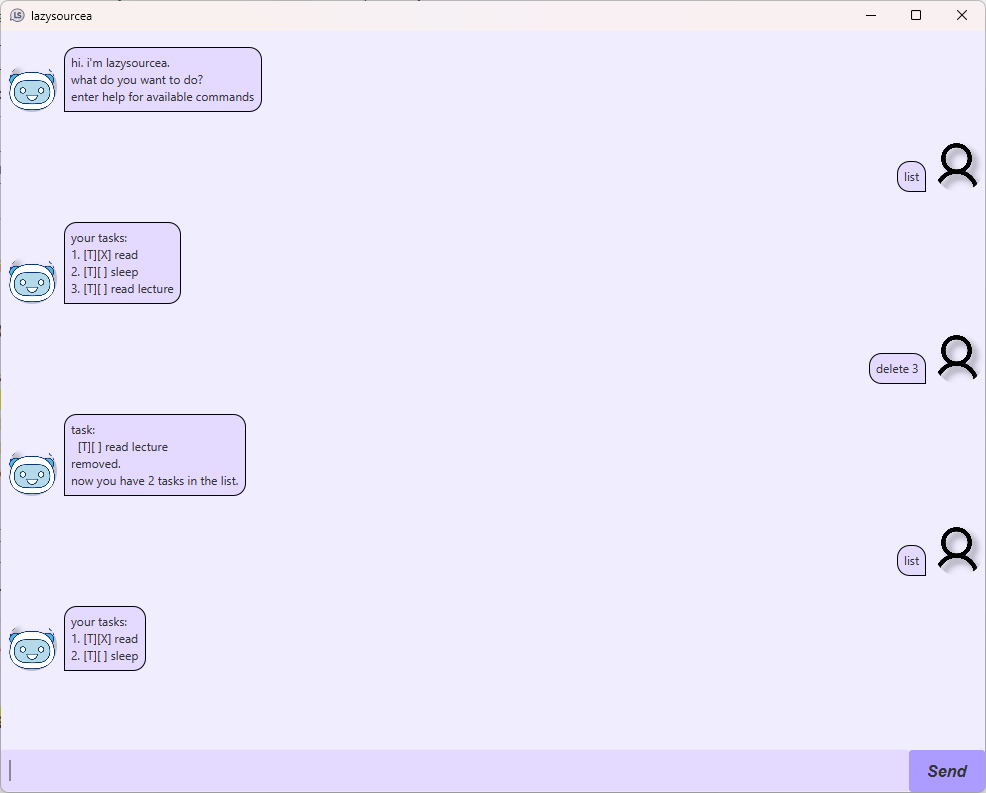

# lazysourcea User Guide



---

## Product overview

lazysourcea is a lightweight, command-line-driven task manager designed to help individuals capture, organise, and track work items with minimal friction. It focuses on rapid entry and simple, predictable behaviour so you can spend less time managing tasks and more time completing them. The app supports three basic task types (todo, deadline, event), persistent storage to disk, and a small set of intuitive commands for searching and manipulating tasks.

This guide explains installation, basic usage, command syntax with examples, date and time parsing rules, and helpful tips for everyday use.

---
## Key features (detailed)

- Fast, keyboard-friendly commands for creating and viewing tasks with minimal typing and predictable results.
- Three task types:
    - Todo: a simple task with no associated date/time.
    - Deadline: a task that must be completed by a given date.
    - Event: a task that occupies a time range.
- Human-friendly, forgiving date parsing with a couple of accepted formats (see Date formats).
- Search and filter by keyword to quickly find tasks.
- Simple import/export capability for backups or sharing task lists.
- Minimal GUI to reduce visual clutter; primary interaction is via concise commands.
- Automatic saving of task data to a local file to ensure work is not lost between sessions.

---
## System requirements

- Java 17 (JRE or JDK) — ensure the `java` executable is available on your PATH.
- A terminal or command prompt for interacting with the application.

Installation and running:
1. Download the JAR distribution (`lazysourcea.jar`).
2. Open a terminal/command prompt in the directory containing the JAR.
3. Run the application with:
     `java -jar lazysourcea.jar`
4. The app will create or update a local data file in the application directory to persist your tasks.


---
## Application behavior and persistence

- The application stores tasks in a local data file (text or JSON format depending on the build). Data is saved automatically after each modifying command (add, mark, delete, etc.).
- When starting, the application loads existing tasks from the data file. If the file does not exist, it will be created.
- Use the export command (if available) to create a human-readable backup, and the import command to restore or migrate tasks.

---
## Commands — overview and examples

Below is a complete reference to the commands supported by lazysourcea. Commands are case-insensitive; parameters and keywords are case-sensitive where noted.

### General/Help
- `help [command]` — Show general help or the detailed usage for a specific command.
    - Example: `help` shows the list of available commands.
    - Example: `help deadline` shows syntax and examples for the `deadline` command.

### Viewing tasks
- `list` — Show all tasks in the current data file, indexed with task numbers, type, status and details.
    - Example output lines:
      ```
      [T][ ] 1. Buy groceries
      [D][X] 2. Submit report (by: 2025-09-20)
      [E][ ] 3. Team meeting (from: 2025-09-22 14:00 to: 2025-09-22 15:00)
      ```
- `find <keyword>` — Search tasks by keyword (case-insensitive); returns any task whose description contains the keyword.
    - Example: `find report` — lists tasks with "report" in the description.

### Adding tasks
- `todo <description>` — Add a todo task with the given description.
    - Example: `todo Buy groceries`
- `deadline <description> /by <date>` — Add a deadline task that must be completed by the provided date.
    - Example: `deadline Submit assignment /by 2025-09-20`
- `event <description> /from <time> /to <time>` — Add an event with a start and end time.
    - Example: `event Team meeting /from 2025-09-22 14:00 /to 2025-09-22 15:00`

### Managing task status and removal
- `mark <n>` — Mark task number n as done (completed).
    - Example: `mark 2`
- `unmark <n>` — Mark task number n as not done.
    - Example: `unmark 2`
- `delete <n>` — Permanently remove task number n from the list.
    - Example: `delete 3`

### Session control
- `bye` — Exit the program and ensure any changes have been saved.
    - Example: `bye`

---
## Date and time formats

lazysourcea accepts simple, common date/time formats. Use one of the supported date formats for deadlines and for date parts of events. Times are optional for deadlines and required for events' start/end when specifying hours.

Supported date formats:
- ISO-like: `yyyy-MM-dd` (e.g., `2019-10-15`)
- Short numeric: `d/M/yyyy` (e.g., `2/12/2019`)

Time formats (for events or explicit times):
- `HH:mm` in 24-hour format (e.g., `14:00`)
- Combined datetime can be specified as `yyyy-MM-dd HH:mm` or `d/M/yyyy HH:mm` as accepted by the `event` command.

Examples:
- Deadline: `deadline Pay bills /by 2025-09-30`
- Event: `event Conference /from 2025-10-01 09:00 /to 2025-10-01 17:00`

If an ambiguous or invalid date/time is provided, the application will report an error and prompt you to correct the input.

---
## Tips and recommended workflow

- Use short, descriptive task descriptions so `find` works well when searching later.
- Use `help <command>` to see examples and edge-case behaviour for each command.

---
## Contact and contribution

If you find bugs or want to suggest improvements, open an issue in the [project repository](https://github.com/kin-chong/ip). Contributions such as documentation updates, bug fixes, and feature requests are typically welcomed.

Tip: when filing an issue, include the exact command you ran, the error output, and the version of the application shown on startup.